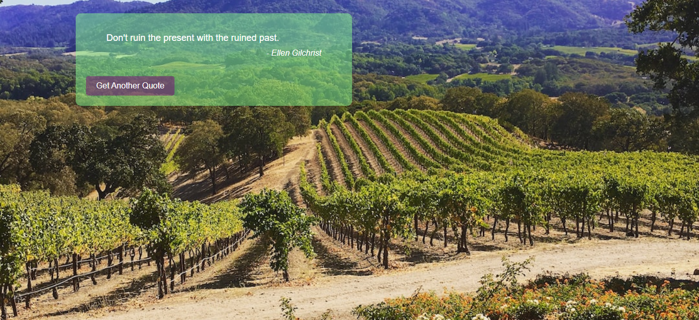

# Quote Images App with Unsplash Backgrounds

This web application fetches random quotes from the Quotable API and pairs them with background images from Unsplash. Users can click a button to refresh both the quote and the background image for a new combination. The app aims to provide users with inspirational quotes accompanied by visually appealing images.

## Features

- Fetch random quotes from the Quotable API.
- Use Unsplash images as background based on the author's name.
- Display quotes and images together on the screen.
- Refresh both quotes and background images with the click of a button.

## Usage

1. Clone this repository to your local machine.
2. Install the required dependencies using `npm install`.
3. Obtain an API key for the Quotable API.
4. Set up an Unsplash account and obtain an API key.
5. Replace the placeholder API keys in the `App.js` file with your actual API keys.
6. Run the application using `npm start`.

## Dependencies

- React
- Unsplash API (for background images)

## Credits

- [Quotable API](https://api.quotable.io/)
- [Unsplash API](https://unsplash.com/developers)
